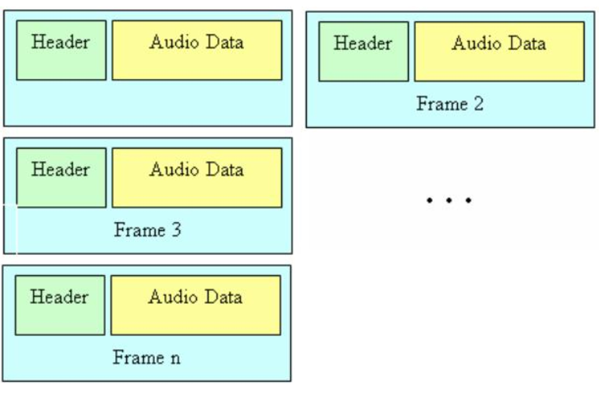
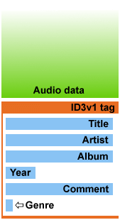

# HCMUS-UNIV-Stenography-MP3

Thực hiện: 2042051 - Nguyễn Thành Long

## I.Mục tiêu:

- Triển khai phương pháp Nhúng thông tin mật vào file MP3 thông qua phương pháp: **POST ENCONDING**
- Phương pháp nhúng tin mật vào các bit ít/không quan trọng trong vùng header.

## II.Tổng quát:

- MP3 là file tiêu chuẩn mở
- Phổ biến
- Phù hợp cho người dùng cuối
- File nén lossy giữ chất lượng âm thanh nhưng vẫn tối ưu không gian lưu trữ

## III.Phương pháp thực hiện

- Với phương pháp nhúng tin mật vào các bit trong header ta cần tìm hiểu về header của file mp3.

- Như đã biết thì mp3 là file âm thanh chia thành các phần nhỏ, mỗi phần nhỏ đó gọi là **FRAME**.

- Mỗi **FRAME** sẽ gồm 2 phần là Header và Audio Data.

### 1.Cấu trúc file MP3

- Nội dung file MP3 sẽ phụ thuộc vào lại encoding sử dụng, nhưng tổng quát có dạng sau:



- Nhưng sau này người ta muốn nhúng thêm các thông tin khác vào cho file mp3 để thuận tiện quảng bá tới người dùng hơn nên mới thiết kế ra TAG (ID3)

- ID3v1 (1996) : Được gán vào cuối file MP3 lưu trữ các meta data tối đa 128 bytes. 



- ID3v2 (1998) : Cảm thấy lưu trữ 128 bytes là chưa đủ nên với sự ra đời của ID3v2 thì metadata đã phong phú hơn rất nhiều, có thể lưu trữ tơí 256 MB. Phần này sẽ nằm ở đầu tệp tin MP3


- Nhưng đôi khi thì việc thêm TAG vào không "Hay" lắm nên TAG sẽ là 1 tùy chọn trong FILE MP3

- Tổng kết lại ta sẽ có cấu trúc file MP3 hoàn chỉnh sau:


### 2.Cấu trúc **HEADER** của 1 FRAME MP3

- HEADER sẽ gồm 4 Bytes (32 bit) thông tin được phân bổ như sau:
( mỗi 1 ô vuông là 1 bit)


- Trong 32 bit này thì sẽ có những BIT ít quan trọng/ không quan trọng (quá trình decode không cần thiết) như là : private bit, copyright bit, home bit và emphasis bit chúng ta có thể lợi dụng để nhúng thông tin mật vào đây.

- Như vậy là có 5 bits mỗi frame chúng ta có thể nhúng dữ liệu

### 3.Thuật toán nhúng và trích xuất thông tin

1. Nhúng:

> Bước 1: Tìm offset Frame đầu tiên của file MP3

> Bước 2: Nhúng thông tin vào các bit đã xác định

> Bước 3: Tìm offset Frame tiếp theo và tiếp tục nhúng cho đến khi hết chuỗi bit msg

2. Trích xuất:

> Bước 1: Tìm offset Frame đầu tiên của file MP3

> Bước 2: Trích xuất thông tin từ các bit đã xác định

> Bước 3: Tìm offset Frame tiếp theo và tiếp tục trích xuất cho đến khi hết Frame


=> Sử dụng phương pháp chèn 100... vào cuối msg để dể dàng trích xuất

### 4.Kỹ thuật tìm offset của Frame đầu tiên và Loại bỏ TAG

- Việc loại bỏ các TAG ra khỏi quá trình nhúng là hết sức cần thiết, nó cần cho việc tìm offset của Frame đầu tiên.
<br>
<br>
- Chúng ta đã biết Tag ID3v1 nằm ở cuối file MP3, nhưng nó là optional nên chúng ta cần detect nó trước khi xóa.
- ID3v1 Tag có kích thước 128bytes và có 3 bytes đầu tiên là "TAG" và nên ta chỉ cần xem xét bytes array [-128:125] xem có phải "TAG" hay không và xóa đi nếu thỏa.

- Với Tag ID3v2 thì phức tạp hơn: theo như mô tả từ [https://id3.org/id3v2.4.0-structure](https://id3.org/id3v2.4.0-structure) thì như sau:

```
     +-----------------------------+
     |      Header (10 bytes)      |
     +-----------------------------+
     |       Extended Header       |
     | (variable length, OPTIONAL) |
     +-----------------------------+
     |   Frames (variable length)  |
     +-----------------------------+
     |           Padding           |
     | (variable length, OPTIONAL) |
     +-----------------------------+
     | Footer (10 bytes, OPTIONAL) |
     +-----------------------------+
```
1. ID3v2 header : Phần đầu tiên của ID3v2 là header chứa 10 bytes
```
     ID3v2/file identifier      "ID3"
     ID3v2 version              $04 00
     ID3v2 flags                %abcd0000
     ID3v2 size             4 * %0xxxxxxx
```
> 3 bytes đầu tiên luôn là "ID3"
>
> byte thứ 7->10 chứa **size** đây là kích thước của TAG (không tính header)<br>
> size được lưu trữ ở dạng 32 bit synchsafe integer <br>
> Chúng ta sẽ sử dụng hàm dưới để chuyển synchsafe sang int

```python
def synchsafe2int(numb):
    return numb[0] << 21 | numb[1] << 14 | numb[2] << 7 | numb[3]
```

> Vậy nếu như tồn tại Tag ID3v2 để đến được offset Frame đầu tiên ta cần nhảy 1 đoạn là :

```synchsafe2int(sizeTag) + 10 bytes```

### 5.Kỹ thuật tìm offset tiếp theo của Frame

- Yêu cầu: Ta đang ở frame đầu tiên làm sao để nhảy qua frame tiếp theo?

- Chúng ta chỉ cần xác định được kích thước (k bytes) của Frame hiện tại và di chuyển (k bytes) để tới offset của frame tiếp theo.

- Ở trên chúng ta đã biết 1 Frame sẽ gồm Header + Audio data. các thông số tính toán của Frame sẽ nằm trong Header


Theo như [https://id3.org/mp3Frame](https://id3.org/mp3Frame) ta biết được rằng:

```
                FrameSize = 144 * BitRate / SampleRate
                   when the padding bit is cleared and
                 FrameSize = (144 * BitRate / SampleRate) + 1
                   when the padding bit is set.
```

a. ID: 1bit [12] : bit này dùng để xác định version MPEG- của file MP3

>ID=0: MPEG-2
>
>ID=1: MPEG-1

b. Layer: 2bit [13-14] : bit này dùng để xác định layer của file MP3

<table style="width: &amp;quot;150px&amp;quot"><tbody><tr>  <td><p class="line862"> 0 0 </p></td>
  <td><p class="line862"> Not defined </p></td>
</tr>
<tr>  <td><span class="anchor" id="line-7"></span><p class="line862">0 1 </p></td>
  <td><p class="line862"> Layer III </p></td>
</tr>
<tr>  <td><span class="anchor" id="line-8"></span><p class="line862">1 0 </p></td>
  <td><p class="line862"> Layer II </p></td>
</tr>
<tr>  <td><span class="anchor" id="line-9"></span><p class="line862">1 1 </p></td>
  <td><p class="line862"> Layer I </p></td>
</tr>
</tbody></table>


c. BitRate: 4bit [16->19]

Bảng dưới được tính là kbit/s khi tính toán ta phải $*1000$ để trở thành bit/s

<table style="width: &amp;quot;600px&amp;quot"><tbody><tr>  <td><p class="line891"><strong> Bitrate<br>
value </strong> </p></td>
  <td><p class="line891"><strong> MPEG-1,<br>
layer I </strong> </p></td>
  <td><p class="line891"><strong> MPEG-1,<br>
layer II </strong> </p></td>
  <td><p class="line891"><strong> MPEG-1,<br>
layer III </strong> </p></td>
  <td><p class="line891"><strong> MPEG-2,<br>
layer I </strong> </p></td>
  <td><p class="line891"><strong> MPEG-2,<br>
layer II </strong> </p></td>
  <td><p class="line891"><strong> MPEG-2,<br>
layer III </strong> </p></td>
</tr>
<tr>  <td><span class="anchor" id="line-14"></span><p class="line862"> 0 0 0 0 </p></td>
  <td colspan="6" style="&amp;quot; text-align: center; &amp;quot;"><p class="line862"> </p></td>
</tr>
<tr>  <td><span class="anchor" id="line-15"></span><p class="line862"> 0 0 0 1 </p></td>
  <td><p class="line862"> 32 </p></td>
  <td><p class="line862"> 32 </p></td>
  <td><p class="line862"> 32 </p></td>
  <td><p class="line862"> 32 </p></td>
  <td><p class="line862"> 32 </p></td>
  <td><p class="line862"> 8 </p></td>
</tr>
<tr>  <td><span class="anchor" id="line-16"></span><p class="line862"> 0 0 1 0 </p></td>
  <td><p class="line862"> 64 </p></td>
  <td><p class="line862"> 48 </p></td>
  <td><p class="line862"> 40 </p></td>
  <td><p class="line862"> 64 </p></td>
  <td><p class="line862"> 48 </p></td>
  <td><p class="line862"> 16 </p></td>
</tr>
<tr>  <td><span class="anchor" id="line-17"></span><p class="line862"> 0 0 1 1 </p></td>
  <td><p class="line862"> 96 </p></td>
  <td><p class="line862"> 56 </p></td>
  <td><p class="line862"> 48 </p></td>
  <td><p class="line862"> 96 </p></td>
  <td><p class="line862"> 56 </p></td>
  <td><p class="line862"> 24 </p></td>
</tr>
<tr>  <td><span class="anchor" id="line-18"></span><p class="line862"> 0 1 0 0 </p></td>
  <td><p class="line862"> 128 </p></td>
  <td><p class="line862"> 64 </p></td>
  <td><p class="line862"> 56 </p></td>
  <td><p class="line862"> 128 </p></td>
  <td><p class="line862"> 64 </p></td>
  <td><p class="line862"> 32 </p></td>
</tr>
<tr>  <td><span class="anchor" id="line-19"></span><p class="line862"> 0 1 0 1 </p></td>
  <td><p class="line862"> 160 </p></td>
  <td><p class="line862"> 80 </p></td>
  <td><p class="line862"> 64 </p></td>
  <td><p class="line862"> 160 </p></td>
  <td><p class="line862"> 80 </p></td>
  <td><p class="line862"> 64 </p></td>
</tr>
<tr>  <td><span class="anchor" id="line-20"></span><p class="line862"> 0 1 1 0 </p></td>
  <td><p class="line862"> 192 </p></td>
  <td><p class="line862"> 96 </p></td>
  <td><p class="line862"> 80 </p></td>
  <td><p class="line862"> 192 </p></td>
  <td><p class="line862"> 96 </p></td>
  <td><p class="line862"> 80 </p></td>
</tr>
<tr>  <td><span class="anchor" id="line-21"></span><p class="line862"> 0 1 1 1 </p></td>
  <td><p class="line862"> 224 </p></td>
  <td><p class="line862"> 112 </p></td>
  <td><p class="line862"> 96 </p></td>
  <td><p class="line862"> 224 </p></td>
  <td><p class="line862"> 112 </p></td>
  <td><p class="line862"> 56 </p></td>
</tr>
<tr>  <td><span class="anchor" id="line-22"></span><p class="line862"> 1 0 0 0 </p></td>
  <td><p class="line862"> 256 </p></td>
  <td><p class="line862"> 128 </p></td>
  <td><p class="line862"> 112 </p></td>
  <td><p class="line862"> 256 </p></td>
  <td><p class="line862"> 128 </p></td>
  <td><p class="line862"> 64 </p></td>
</tr>
<tr>  <td><span class="anchor" id="line-23"></span><p class="line862"> 1 0 0 1 </p></td>
  <td><p class="line862"> 288 </p></td>
  <td><p class="line862"> 160 </p></td>
  <td><p class="line862"> 128 </p></td>
  <td><p class="line862"> 288 </p></td>
  <td><p class="line862"> 160 </p></td>
  <td><p class="line862"> 128 </p></td>
</tr>
<tr>  <td><span class="anchor" id="line-24"></span><p class="line862"> 1 0 1 0 </p></td>
  <td><p class="line862"> 320 </p></td>
  <td><p class="line862"> 192 </p></td>
  <td><p class="line862"> 160 </p></td>
  <td><p class="line862"> 320 </p></td>
  <td><p class="line862"> 192 </p></td>
  <td><p class="line862"> 160 </p></td>
</tr>
<tr>  <td><span class="anchor" id="line-25"></span><p class="line862"> 1 0 1 1 </p></td>
  <td><p class="line862"> 352 </p></td>
  <td><p class="line862"> 224 </p></td>
  <td><p class="line862"> 192 </p></td>
  <td><p class="line862"> 352 </p></td>
  <td><p class="line862"> 224 </p></td>
  <td><p class="line862"> 112 </p></td>
</tr>
<tr>  <td><span class="anchor" id="line-26"></span><p class="line862"> 1 1 0 0 </p></td>
  <td><p class="line862"> 384 </p></td>
  <td><p class="line862"> 256 </p></td>
  <td><p class="line862"> 224 </p></td>
  <td><p class="line862"> 384 </p></td>
  <td><p class="line862"> 256 </p></td>
  <td><p class="line862"> 128 </p></td>
</tr>
<tr>  <td><span class="anchor" id="line-27"></span><p class="line862"> 1 1 0 1 </p></td>
  <td><p class="line862"> 416 </p></td>
  <td><p class="line862"> 320 </p></td>
  <td><p class="line862"> 256 </p></td>
  <td><p class="line862"> 416 </p></td>
  <td><p class="line862"> 320 </p></td>
  <td><p class="line862"> 256 </p></td>
</tr>
<tr>  <td><span class="anchor" id="line-28"></span><p class="line862"> 1 1 1 0 </p></td>
  <td><p class="line862"> 448 </p></td>
  <td><p class="line862"> 384 </p></td>
  <td><p class="line862"> 320 </p></td>
  <td><p class="line862"> 448 </p></td>
  <td><p class="line862"> 384 </p></td>
  <td><p class="line862"> 320 </p></td>
</tr>
<tr>  <td><span class="anchor" id="line-29"></span><p class="line862"> 1 1 1 1 </p></td>
  <td colspan="6" style="&amp;quot; text-align: center; &amp;quot;"><p class="line862"> </p></td>
</tr>
</tbody></table>

b. SampleRate: 2bit [20->21]

<table style="width: &amp;quot;255px&amp;quot"><tbody><tr>  <td><p class="line891"><strong> Frequency<br>
Value</strong> </p></td>
  <td><p class="line891"><strong>MPEG-1</strong> </p></td>
  <td><p class="line891"><strong>MPEG-2</strong> </p></td>
</tr>
<tr>  <td><span class="anchor" id="line-34"></span><p class="line862">0 0 </p></td>
  <td><p class="line862">44100 Hz </p></td>
  <td><p class="line862">22050 Hz </p></td>
</tr>
<tr>  <td><span class="anchor" id="line-35"></span><p class="line862">0 1 </p></td>
  <td><p class="line862">48000 Hz </p></td>
  <td><p class="line862">24000 Hz </p></td>
</tr>
<tr>  <td><span class="anchor" id="line-36"></span><p class="line862">1 0 </p></td>
  <td><p class="line862">32000 Hz </p></td>
  <td><p class="line862">16000 Hz </p></td>
</tr>
<tr>  <td><span class="anchor" id="line-37"></span><p class="line862">1 1 </p></td>
  <td colspan="2" style="&amp;quot; text-align: center; &amp;quot;"><p class="line862"> </p></td>
</tr>
</tbody></table>

c. Padding bit: 1 bit [22]